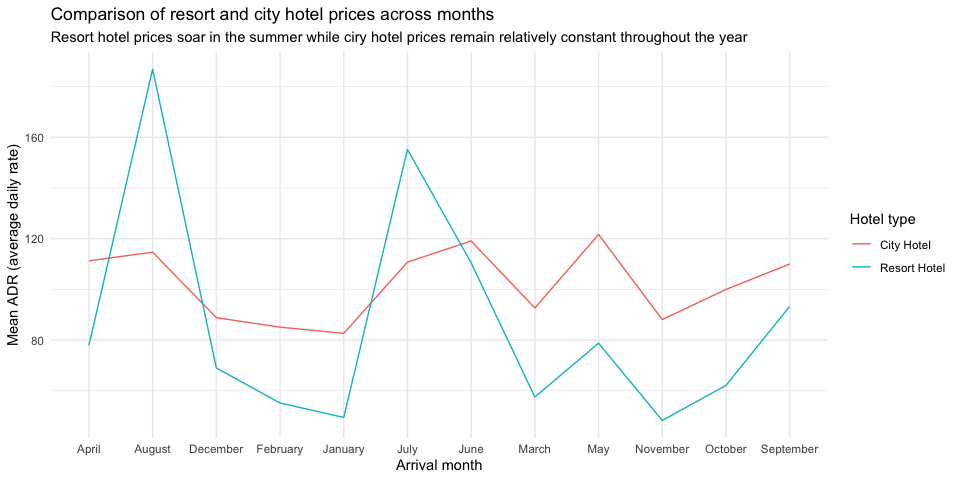
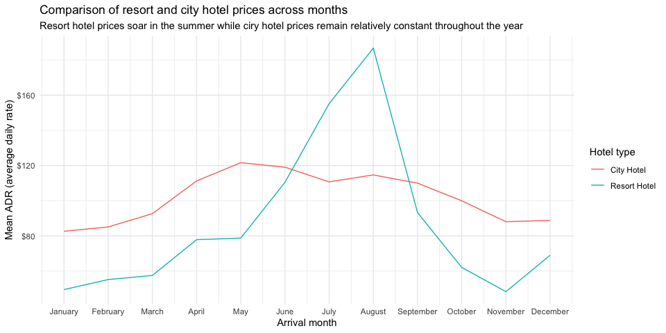

Hotel bookings - factors - solutions
================
Mine Çetinkaya-Rundel

``` r
library(tidyverse)
library(skimr)
library(scales)
library(lubridate)
library(glue)
```

``` r
# From TidyTuesday: https://github.com/rfordatascience/tidytuesday/blob/master/data/2020/2020-02-11/readme.md
hotels <- read_csv("https://raw.githubusercontent.com/rfordatascience/tidytuesday/master/data/2020/2020-02-11/hotels.csv")
```

First, knit the document and view the following visualisation. How are
the months ordered? What would be a better order? Then, reorder the
months on the x-axis (levels of `arrival_date_month`) in a way that
makes more sense. You will want to use a function from the **forcats**
package, see <https://forcats.tidyverse.org/reference/index.html> for
inspiration and help.

**Stretch goal:** If you finish the above task before time is up, change
the y-axis label so the values are shown with dollar signs, e.g. $80
instead of 80. You will want to use a function from the **scales**
package, see <https://scales.r-lib.org/reference/index.html> for
inspiration and help.

#### Original solution

``` r
hotels_grouped <- hotels %>%
  group_by(hotel, arrival_date_month) %>%   # group by hotel type and arrival month
  summarise(mean_adr = mean(adr))         # calculate mean adr for each group
```

    ## `summarise()` has grouped output by 'hotel'. You can override using the `.groups` argument.

``` r
ggplot(hotels_grouped, aes(
    x = arrival_date_month,                 # x-axis = arrival_date_month
    y = mean_adr,                           # y-axis = mean_adr calculated above
    group = hotel,                          # group lines by hotel type
    color = hotel)                          # and color by hotel type
    ) +
  geom_line() +                             # use lines to represent data
  theme_minimal() +                         # use a minimal theme
  labs(x = "Arrival month",                 # customize labels
       y = "Mean ADR (average daily rate)",
       title = "Comparison of resort and city hotel prices across months",
       subtitle = "Resort hotel prices soar in the summer while ciry hotel prices remain relatively constant throughout the year",
       color = "Hotel type")
```

<!-- -->

### Here are 4 ways to reorder the x axis…

#### fct_reorder

``` r
hotels %>%
  mutate(month_number =
           month(ymd( glue(
             "{arrival_date_year} {arrival_date_month} {arrival_date_day_of_month}"
             )))) %>%
  mutate(arrival_date_month = fct_reorder(arrival_date_month,
                                          month_number)) %>%
  group_by(hotel, arrival_date_month) %>%   # group by hotel type and arrival month
  summarise(mean_adr = mean(adr)) %>%       # calculate mean adr for each group
  ggplot(aes(
    x = arrival_date_month,                 # x-axis = arrival_date_month
    y = mean_adr,                           # y-axis = mean_adr calculated above
    group = hotel,                          # group lines by hotel type
    color = hotel)                          # and color by hotel type
    ) +
  geom_line() +                             # use lines to represent data
  scale_y_continuous(labels=label_dollar()) +
  theme_minimal() +                         # use a minimal theme
  labs(x = "Arrival month",                 # customize labels
       y = "Mean ADR (average daily rate)",
       title = "Comparison of resort and city hotel prices across months",
       subtitle = "Resort hotel prices soar in the summer while ciry hotel prices remain relatively constant throughout the year",
       color = "Hotel type")
```

<!-- -->

#### fct_relevel

``` r
hotels %>%
  mutate(arrival_date_month = fct_relevel(arrival_date_month,
                                          "January",
                                          "February",
                                          "March",
                                          "April",
                                          "May",
                                          "June",
                                          "July",
                                          "August",
                                          "September",
                                          "October",
                                          "November",
                                          "December")) %>%
  group_by(hotel, arrival_date_month) %>%   # group by hotel type and arrival month
  summarise(mean_adr = mean(adr)) %>%       # calculate mean adr for each group
  ggplot(aes(
    x = arrival_date_month,                 # x-axis = arrival_date_month
    y = mean_adr,                           # y-axis = mean_adr calculated above
    group = hotel,                          # group lines by hotel type
    color = hotel)                          # and color by hotel type
    ) +
  geom_line() +                             # use lines to represent data
  scale_y_continuous(labels=label_dollar()) +
  theme_minimal() +                         # use a minimal theme
  labs(x = "Arrival month",                 # customize labels
       y = "Mean ADR (average daily rate)",
       title = "Comparison of resort and city hotel prices across months",
       subtitle = "Resort hotel prices soar in the summer while ciry hotel prices remain relatively constant throughout the year",
       color = "Hotel type")
```

<!-- -->

#### factor with levels

``` r
labels <- c("January",
            "February",
            "March",
            "April",
            "May",
            "June",
            "July",
            "August",
            "September",
            "October",
            "November",
            "December")
hotels %>%
  mutate(arrival_date_month = factor(arrival_date_month, labels)) %>%
  group_by(hotel, arrival_date_month) %>%   # group by hotel type and arrival month
  summarise(mean_adr = mean(adr)) %>%       # calculate mean adr for each group
  ggplot(aes(
    x = arrival_date_month,                 # x-axis = arrival_date_month
    y = mean_adr,                           # y-axis = mean_adr calculated above
    group = hotel,                          # group lines by hotel type
    color = hotel)                          # and color by hotel type
    ) +
  geom_line() +                             # use lines to represent data
  scale_y_continuous(labels=label_dollar()) +
  theme_minimal() +                         # use a minimal theme
  labs(x = "Arrival month",                 # customize labels
       y = "Mean ADR (average daily rate)",
       title = "Comparison of resort and city hotel prices across months",
       subtitle = "Resort hotel prices soar in the summer while ciry hotel prices remain relatively constant throughout the year",
       color = "Hotel type")
```

<!-- -->

#### scale_x\_continuous

``` r
hotels %>%
  mutate(arrival_date_m2 = month(ymd( glue(
    "{arrival_date_year} {arrival_date_month} {arrival_date_day_of_month}")))) %>%
  group_by(hotel, arrival_date_m2) %>%   # group by hotel type and arrival month
  summarise(mean_adr = mean(adr)) %>%       # calculate mean adr for each group
  ggplot(aes(
    x = arrival_date_m2,                 # x-axis = arrival_date_month
    y = mean_adr,                           # y-axis = mean_adr calculated above
    group = hotel,                          # group lines by hotel type
    color = hotel)                          # and color by hotel type
    ) +
  geom_line() +                             # use lines to represent data
    scale_x_continuous(
    breaks = seq_along(month.name), 
    labels = month.name
  ) +
  scale_y_continuous(labels=label_dollar()) +
  theme_minimal() +                         # use a minimal theme
  labs(x = "Arrival month",                 # customize labels
       y = "Mean ADR (average daily rate)",
       title = "Comparison of resort and city hotel prices across months",
       subtitle = "Resort hotel prices soar in the summer while ciry hotel prices remain relatively constant throughout the year",
       color = "Hotel type")
```

<!-- -->
